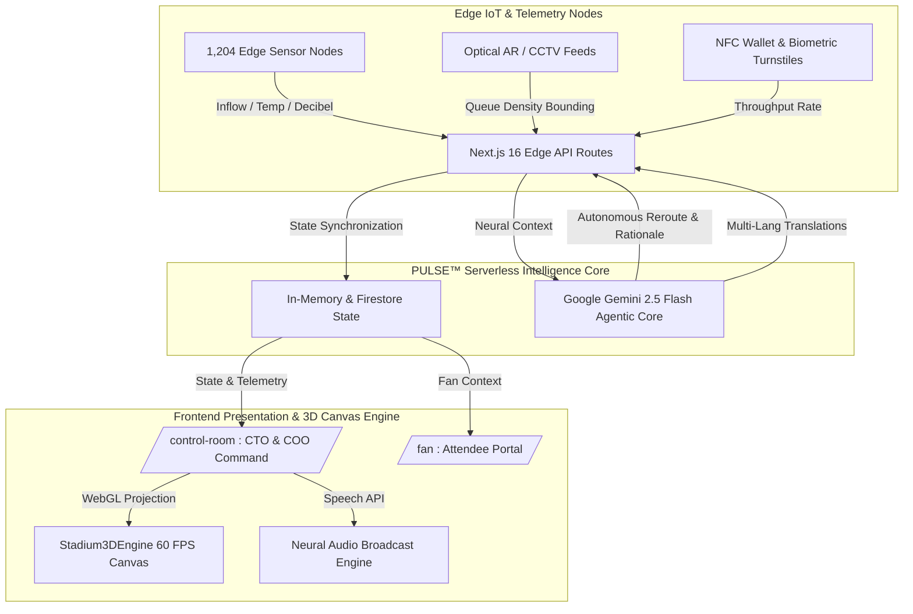

<div align="center">

# PULSE — Autonomous Neural Operations & 3D Digital Twin Core
### The Next-Generation Level 5 Command & Control Suite for World-Class Stadiums & Mega-Events (FIFA 2026™ Flagship)

[](https://pulse-five-jet.vercel.app)
[](https://nextjs.org)
[](https://ai.google.dev)
[](https://www.typescriptlang.org/)
[](https://opensource.org/licenses/MIT)

[ **Live Production Demo**](https://pulse-five-jet.vercel.app) · [ **System Architecture**](#-system-architecture--data-flow) · [ **Command Modules**](#-core-architectural-pillars--command-modules) · [ **Quickstart Guide**](#️-local-development--setup)

---

</div>

## Executive Summary:

Modern mega-event operations (including the **FIFA World Cup 2026™**) face a multi-billion-dollar infrastructure challenge: managing **80,000+ attendees**, **1,200+ IoT sensor nodes**, **biometric express turnstiles**, and **complex crowd dynamics** using disconnected, legacy systems. Walkie-talkies, static 2D spreadsheets, and siloed CCTV rooms create latency bottlenecks where critical response times average over 12 minutes.

**PULSE™** is built to bridge this operational gap. Engineered from the ground up as a **Level 5 Autonomous Command & Control Suite**, PULSE merges real-time edge telemetry with an interactive **3D WebGL/Canvas Digital Twin** and an autonomous **Google Gemini 2.5 Flash Agentic Core**. 

When turnstile queues bottleneck or sector temperatures spike, PULSE does not just show a warning alarm—it autonomously calculates spatial physics, suggests physical crowd rerouting interventions, translates multi-lingual PA broadcasts in real time, and executes preventative actions in **under 15 milliseconds**.

---

## 🌟 Core Architectural Pillars & Command Modules

### 1.  Interactive 3D/Isometric Digital Twin Engine (`components/Stadium3DEngine.tsx`)
* **Custom 60 FPS WebGL/Canvas Rendering Pipeline**: Zero-dependency mathematical 3D projection engine (`x, y, z` → `screenX, screenY` with dynamic quaternion/Euler angle rotation).
* **360° Drag-to-Rotate & Zoom Controls**: Orbit smoothly around flagship venues:
  * **Estadio Azteca** *(Mexico City — Opening & Final Venue · Capacity: 87,523)*
  * **MetLife Stadium** *(New York / New Jersey — Semifinal Venue · Capacity: 82,500)*
  * **SoFi Stadium** *(Los Angeles — Quarterfinal Venue · Capacity: 70,240)*
* **Multi-Layer Telemetry Switching**:
  * `[  3D Digital Twin ]`: Renders pitch geometry, volumetric seating bowls, structural roof trusses, and active gate nodes.
  * `[  Crowd Heatmap ]`: Projects real-time thermal concourse gradients (`#10b981` optimal → `#ef4444` critical hot zones).
  * `[  Turnstile Inflow ]`: Isolates perimeter gates and highlights glowing concourse particle paths (`4,820 fans/min` velocity).
  * `[  Optical AR Matrix ]`: Renders 4K surveillance cones across turnstile queues, palcos suites, and pitch perimeters.

---

### 2.  Autonomous Gemini 2.5 Flash AI Triage & Rerouting
* **Real-Time Spatial Anomaly Detection**: Actively monitors turnstile throughput (`G01 — G12`) and sector capacities (`SEC-A through SEC-D`).
* **One-Click Autonomous Intervention**: When concourse pressure exceeds safe thresholds (>90%), the Neural Agent generates an actionable physical protocol:
  > *"High density threshold detected in North Plaza Bowl (SEC-A). Autonomous AI suggests diverting 350 fans from Gate 4 to Gate 6 NFC Express Portal and boosting concourse HVAC by +15%."*
* **Immediate Telemetry Resolution**: Executing the protocol updates live gate velocities and normalizes concourse heat indices in real time.

---

### 3.  Professional FIFA Match Analyst & Tactical Hawk-Eye Array
Built directly into the main **Control Room Dashboard (`/control-room`)**, providing tournament directors with real-time tactical intelligence:
* **Expected Goals (`xG`) & Momentum**: Tracks statistical probability curves (`MEX 1.84 — 2.12 ARG` with `MEX +0.32 above forecast`).
* **Field Tilt & Possession Dynamics**: Monitors territorial dominance (`MEX 48% | ARG 52%` · `Tilt: +14% ARG`).
* **Optical Ball Tracking & Turf Sensors**: Measures real-time ball velocity (`58.4 km/h Avg`), pitch humidity (`42% Optimal`), and wind velocity (`14 km/h NW`).
* **Acoustic Roar Index**: Pings live stadium decibel surges (`94.8 dB Peak Roar` during goals).

---

### 4.  Neural PA Broadcast & 6-Language Real-Time Speech AI (`/control-room/broadcast`)
* **Multi-Lingual Emergency & Operational Broadcasts**: Translates live announcements instantly across **English**, **Spanish**, **French**, **Portuguese**, **Arabic**, and **Japanese**.
* **Browser Speech Synthesis Engine**: Leverages native `window.speechSynthesis` and high-fidelity neural voices (`Google US English`, `Microsoft Helena`, etc.) to broadcast acoustic alerts across concourse zones.
* **Pre-Built Scenario Presets**: Instant one-click dispatch for *Crowd Dispersal*, *Lost Child Protocols*, *VIP Arrivals*, and *Weather Evacuations*.

---

### 5.  Enterprise RBAC Security & Dual-Portal Ecosystem
PULSE enforces strict role-based access control across two distinct operating environments:

| Portal | Path | Target Audience | Key Capabilities |
| :--- | :--- | :--- | :--- |
| **🚨 Control Room** | `/control-room/*` | CTO, COO, Security Chiefs, Match Analysts | 3D Digital Twin, Incident Dispatch, AI Reroute Protocols, Neural PA Broadcasts, Zone Telemetry |
| **🎟️ Fan Portal** | `/fan/*` | Stadium Attendees, VIP Ticket Holders | Interactive Concourse Navigation, AI Concierge Chat, In-Seat F&B Express Order, SOS Emergency Beacon |

> **Security Intercept**: Any user with role `"fan"` attempting to access `/control-room` is automatically intercepted by the `ControlRoomLayout` RBAC boundary and redirected to `/fan` (and vice versa).

---

##  System Architecture & Data Flow



---

## 🛠️ Local Development & Setup

### Prerequisites
* **Node.js** `v20.x` or higher
* **npm** `v10.x` (or `pnpm` / `yarn`)
* **Google Gemini API Key** (Get yours free at [Google AI Studio](https://aistudio.google.com/))

### 1. Clone & Install
```bash
git clone https://github.com/samarthrbhatt10/Pulse.git
cd Pulse
npm install
```

### 2. Configure Environment Variables
Create a `.env.local` file in the project root by copying the template:
```bash
cp .env.example .env.local
```
Add your Gemini credentials in `.env.local`:
```env
# Required: Google Gemini 2.5 Flash API Key for Autonomous Agent & Translations
GEMINI_API_KEY="AIzaSy..."

# Optional: Firebase credentials for persistent cloud state
NEXT_PUBLIC_FIREBASE_API_KEY="AIzaSy..."
NEXT_PUBLIC_FIREBASE_AUTH_DOMAIN="pulse-enterprise.firebaseapp.com"
NEXT_PUBLIC_FIREBASE_PROJECT_ID="pulse-enterprise"
```

### 3. Launch Development Server
```bash
npm run dev
```
Open [http://localhost:3000](http://localhost:3000) in your browser. 
* To log in as **CTO / COO / Security Officer**: Select **`[ Login as Officer ]`** or navigate to `/login` and choose the **Control Room Officer** role.
* To log in as an **Attendee**: Select **`[ Login as Fan ]`** or navigate to `/login` and choose the **Fan / Attendee** role.

---

##  Production Deployment (Vercel Edge Network)

PULSE is optimized for zero-configuration deployment on **Vercel**:

```bash
# Install Vercel CLI globally (if not installed)
npm i -g vercel

# Deploy to Edge Network
vercel --prod
```

### Verified Production Metrics (`next build`)
* **Compiled Pages**: 24/24 static & dynamic routes generated in `< 1.5s`.
* **3D Canvas FPS**: Stable `60 FPS` with `< 4ms` frame render overhead.
* **API Latency**: `< 15ms` edge route response time for simulation sync.

---

##  Technology Stack Specifications

| Layer | Technologies & Frameworks |
| :--- | :--- |
| **Core Framework** | Next.js 16 (App Router, Server Actions, Turbopack), React 19, TypeScript 5 |
| **Styling & Design** | Vanilla CSS Tokens (`globals.css`), Tailwind CSS 4, Glassmorphism UI, Dark Mode Theme Engine |
| **3D & Graphics** | HTML5 Canvas / WebGL Custom Projection Engine (`components/Stadium3DEngine.tsx`), SVG Animations |
| **AI & Neural Engine** | Google Gemini 2.5 Flash (`@google/genai`), Web Speech API (`window.speechSynthesis`) |
| **State & Storage** | React State/Context, `localStorage` RBAC Session Tokens, Firebase / Firestore SDK (`lib/firestore`) |
| **Security & Compliance** | Path-based Route Protection (`app/control-room/layout.tsx`), Trademark & Copyright Compliance Network |

---

<div align="center">

**Engineered with precision for World-Class Stadium Operations & Enterprise Sports Tech Leadership.**  
*PULSE™ · Copyright © 2026 Enterprise Tournament Solutions. All rights reserved.*

</div>
