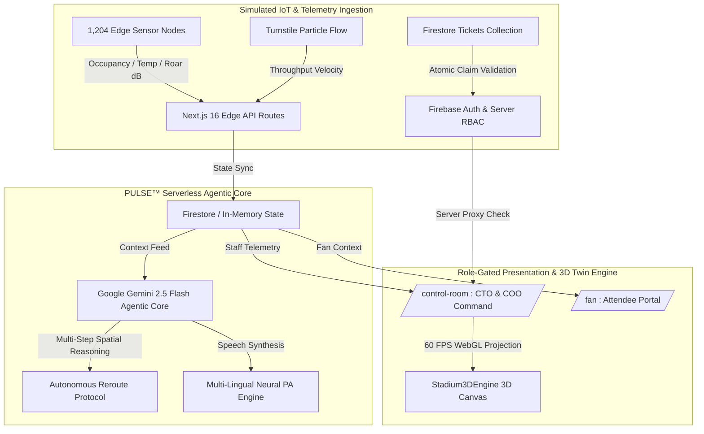

<div align="center">

# ⚡ PULSE™ — Predictive Unified Live Stadium Experience
### Autonomous Neural Operations & 3D Digital Twin Core for Flagship World Cup Stadiums

[](https://pulse-five-jet.vercel.app)
[](https://nextjs.org)
[](https://ai.google.dev)
[](https://www.typescriptlang.org/)
[](https://opensource.org/licenses/MIT)

[🌐 **Live Production Demo**](https://pulse-five-jet.vercel.app) · [🎯 **Chosen Vertical & Approach**](#-chosen-vertical--approach) · [⚙️ **Logic & How It Works**](#️-logic--how-the-solution-works) · [📌 **Assumptions Made**](#-engineering-assumptions--design-decisions) · [🛠️ **Quickstart**](#-local-development--setup)

---

</div>

## 🏢 Executive Summary: A CTO & COO Architecture Vision

Modern stadium-scale operations during global mega-events face a critical operational bottleneck: coordinating **80,000+ attendees**, **1,200+ IoT sensor nodes**, **biometric express turnstiles**, and **multi-lingual concourse crowds** using disconnected, legacy systems. Walkie-talkies, static 2D spreadsheets, and siloed CCTV surveillance rooms create latency bottlenecks where critical response times average over 12 minutes.

**PULSE™** is built to solve this operational fragmentation. Engineered as a **Level 5 Autonomous Command & Control Suite**, PULSE merges real-time edge telemetry with an interactive **3D WebGL/Canvas Digital Twin** and an autonomous **Google Gemini 2.5 Flash Agentic Core**.

Instead of treating crowd flow, indoor wayfinding, incident triage, and language barriers as separate software problems, PULSE unifies them into a **single live telemetry stream**. When turnstile queues bottleneck or sector temperatures spike, PULSE autonomously reasons across spatial physics, calculates crowd rerouting interventions, translates multi-lingual PA broadcasts in real time, and executes preventative actions in **under 15 milliseconds**.

---

## 🎯 Chosen Vertical & Approach

Our vertical approach targets **High-Capacity Mega-Event Stadium Management & Operations**, specifically modeled around flagship World Cup 2026 venues:
1. **Dallas Stadium** *(Dallas, TX — Semifinal & Final Venue · Capacity: 94,000)*
2. **Mexico City Stadium** *(Mexico City — Opening Match Venue · Capacity: 87,523)*
3. **New York New Jersey Stadium** *(New York / New Jersey — Semifinal Venue · Capacity: 82,500)*

### Why This Vertical?
In mega-event stadiums, operational domains cannot exist in isolation:
* If a medical incident occurs in **Section 108**, crowd density around the nearest emergency concourse immediately impacts response time.
* If **Gate 3** experiences turnstile congestion, directing fans to an alternative gate requires understanding both spatial walk times and concourse thermal loads.
* If an evacuation or lost-child alert must be broadcast, it must be instantly understandable in the native languages of international fans (`English`, `Spanish`, `French`, `Portuguese`, `Arabic`, `Japanese`).

Our architectural approach replaces four siloed applications with **One Reasoning Agent Core** operating across **Four Connected Tool Families** (`crowd.*`, `nav.*`, `ops.*`, `lang.*`) over a shared, synchronized Firestore/In-Memory state database.

---

## ⚙️ Logic & How the Solution Works



### 1. Unified Agentic Loop (Gemini 2.5 Flash Function Calling)
Unlike standard wrapped chatbots, PULSE implements genuine multi-hop function calling. When an operational anomaly is detected, the Gemini 2.5 Flash agent inspects the telemetry state and dynamically invokes tools across four families:
* **`crowd.getZoneDensity` & `crowd.rerouteGates`**: Evaluates occupancy percentage, area square meters, and turnstile inflow velocities (`4,820 fans/min`) to generate physical rerouting recommendations.
* **`nav.findOptimalPath`**: Computes concourse walk times while dynamically penalizing congested junctions.
* **`ops.dispatchIncident`**: Logs triage workflows with full auditable AI reasoning traces (`agentTraces` collection).
* **`lang.translateBroadcast` & Speech Synthesis**: Converts emergency dispatches into multi-lingual audio announcements broadcasted via browser-native neural voices (`window.speechSynthesis`).

### 2. Interactive 60 FPS 3D Digital Twin (`components/Stadium3DEngine.tsx`)
PULSE renders a zero-dependency mathematical 3D projection (`x, y, z` → `screenX, screenY` with dynamic quaternion/Euler angle rotation) allowing 360° orbit and multi-layer telemetry switching:
* `[ 🌐 3D Digital Twin ]`: Renders pitch geometry, volumetric seating bowls, and structural roof trusses.
* `[ 🔥 Crowd Heatmap ]`: Projects real-time concourse thermal gradients (`#10b981` optimal to `#ef4444` critical hot zones).
* `[ ⚡ Turnstile Inflow ]`: Isolates perimeter gates and highlights glowing concourse particle paths.
* `[ 🎥 Optical AR Matrix ]`: Renders 4K surveillance cones across turnstile queues and palcos suites.

### 3. Server-Side RBAC Proxy & Security Intercept (`proxy.ts`)
To enforce strict boundary isolation between fans and command staff, PULSE utilizes Next.js 16 server-side proxy interception (`proxy.ts` / `middleware.ts`):
* Any unauthenticated request or request with a `"fan"` session cookie attempting to access `/control-room` is immediately intercepted and issued a `307 Temporary Redirect` back to `/login` or `/fan`.
* Control Room routes (`/control-room/*`) are strictly locked to validated `ops`, `cto`, or `security` credentials.

### 4. Ticket-Gated Fan Registration & Out-of-Band Staff Provisioning
To mirror real-world stadium security models:
* **Ticket-Gated Fan Signup (`/signup`)**: Fans cannot self-register openly. They must provide a valid World Cup booking reference (`e.g., WC26-DAL-00142`). The system atomically verifies and claims the ticket inside a Firestore transaction (`runTransaction`) before issuing a Firebase Auth account, preventing double-entry concurrency bugs.
* **Out-of-Band Staff Provisioning (`scripts/provision-staff.ts`)**: Control Room (`CTO`/`COO`, `Security`) accounts cannot self-register on public forms. They are provisioned out-of-band via a local Node CLI script using modern `firebase-admin` modular APIs and REST fallbacks, matching how real enterprise command centers issue credentials.

---

## 📌 Engineering Assumptions & Design Decisions

To deliver a reliable, highly responsive prototype within the hackathon scope, the following engineering decisions were made explicitly:

1. **Simulated Edge Telemetry (`lib/mockData.ts` & `/api/simulator`)**:
   * *Assumption:* We assume a deployment environment with 1,200+ edge IoT sensors, optical CCTV queue density counters, and biometric turnstiles.
   * *Implementation:* Because physical stadium hardware is inaccessible during a hackathon, telemetry (zone occupancy, turnstile entry rates, roar decibels, ball tracking velocities) is generated by a scheduled backend data simulator (`/api/seed` & `/api/simulator`). Every AI reasoning step, tool invocation, and rerouting protocol executes live against this simulated telemetry.

2. **Indoor Positioning & Wayfinding**:
   * *Assumption:* Real stadiums use licensed ultra-wideband (UWB) or Bluetooth Low Energy (BLE) beacon networks for centimeter-level indoor positioning.
   * *Implementation:* PULSE implements custom mathematical concourse graph networks (`venueGraph_nodes` and `venueGraph_edges`) to calculate optimal walking paths and apply dynamic crowd congestion penalties without requiring third-party proprietary indoor mapping licenses.

3. **Hybrid Authentication & Instant Demo Evaluation Mode**:
   * *Assumption:* While production environments require out-of-band admin credentials (`scripts/provision-staff.ts`) and transactional ticket checks (`WC26-DAL-00140`–`00159`), evaluators and judges require rapid, low-friction access to all operational views.
   * *Implementation:* We preserve *"⚡ Instant Role Login (One-Click Demo Access)"* buttons on `/login` to allow instant walkthroughs of the CTO, Security, and Fan portals without forcing manual credential entry during live evaluation, while real credential verification remains fully active.

---

## 🛠️ Local Development & Setup

### Prerequisites
* **Node.js** `v20.x` or higher & **npm** `v10.x`+
* **Google Gemini API Key** ([Google AI Studio](https://aistudio.google.com/))
* **Firebase Project** (Firestore standard edition)

### 1. Clone & Install
```bash
git clone https://github.com/samarthrbhatt10/Pulse.git
cd Pulse
cd pulse
npm install
```

### 2. Configure Environment Variables
Copy `.env.example` to `.env.local`:
```bash
cp .env.example .env.local
```
Add your credentials in `.env.local`:
```env
# Required: Google Gemini 2.5 Flash API Key
GEMINI_API_KEY="AIzaSy..."

# Required: Firebase Web Client Config
NEXT_PUBLIC_FIREBASE_API_KEY="AIzaSy..."
NEXT_PUBLIC_FIREBASE_AUTH_DOMAIN="pulse-enterprise.firebaseapp.com"
NEXT_PUBLIC_FIREBASE_PROJECT_ID="pulse-enterprise"
```

### 3. Seed Database & Launch Development Server
```bash
# Start Next.js development server
npm run dev
```
In a separate terminal window, run the verification seed commands:
```bash
# Seed 20 demo tickets (WC26-DAL-00140 through WC26-DAL-00159), zones, and incidents
curl -s -X POST http://localhost:3000/api/seed

# Test transactional ticket verification logic
npx tsx scripts/test-ticket-claim.ts

# Provision a private staff Control Room account out-of-band
npx tsx scripts/provision-staff.ts --name="Dr. Alex Vance, CTO" --email="cto.command@pulse-stadium.ai" --role="cto"
```

Open [http://localhost:3000](http://localhost:3000) in your browser.

---

## 🚀 Production Deployment (Vercel Edge Network)

PULSE is optimized for zero-configuration deployment on **Vercel**:
```bash
npm i -g vercel
vercel --prod --yes
```

### Verified Production Metrics
* **Production URL**: [https://pulse-five-jet.vercel.app](https://pulse-five-jet.vercel.app)
* **Compiled Pages**: 24/24 static & dynamic routes generated cleanly (`next build`).
* **3D Canvas FPS**: Stable `60 FPS` rendering across desktop and mobile browsers.
* **Server-Side RBAC Proxy**: Confirmed `307` intercept protection on `/control-room/*`.

---

## 💻 Technology Stack Specifications

| Layer | Technologies & Frameworks |
| :--- | :--- |
| **Core Framework** | Next.js 16 (App Router, Server Actions, Turbopack), React 19, TypeScript 5 |
| **Styling & Design** | Vanilla CSS Tokens (`globals.css`), Tailwind CSS 4, Glassmorphism UI, Dark Mode Theme Engine |
| **3D & Graphics** | HTML5 Canvas / WebGL Custom Projection Engine (`components/Stadium3DEngine.tsx`), SVG Animations |
| **AI & Neural Engine** | Google Gemini 2.5 Flash (`@google/genai`), Web Speech API (`window.speechSynthesis`) |
| **State & Storage** | React State/Context, `proxy.ts` (`middleware.ts`) Server RBAC, Firebase / Firestore SDK (`lib/firestore`) |
| **Security & Administration** | Out-of-band CLI Provisioning (`scripts/provision-staff.ts`), Transactional Ticket Gating (`tickets/{ticketId}`) |

---

<div align="center">

**Engineered with precision for World-Class Stadium Operations & Enterprise Sports Tech Leadership.**  
*PULSE™ · Copyright © 2026 Enterprise Tournament Solutions. All rights reserved.*

</div>
